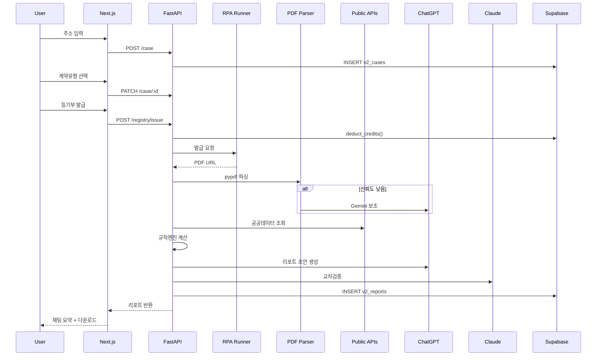

# 🏠 집체크 v2 부동산 계약 분석 시스템 구현 가이드

**작성일**: 2025-01-27
**버전**: 1.0.0

---

## 📋 목차

1. [시스템 개요](#-시스템-개요)
2. [완료된 작업](#-완료된-작업)
3. [상태머신 플로우](#-상태머신-플로우)
4. [UI 컴포넌트 사용법](#-ui-컴포넌트-사용법)
5. [다음 구현 단계](#-다음-구현-단계)
6. [데이터 흐름](#-데이터-흐름)
7. [API 엔드포인트](#-api-엔드포인트)
8. [테스트 가이드](#-테스트-가이드)

---

## 🎯 시스템 개요

집체크 v2는 **채팅 기반 부동산 계약 분석 시스템**으로, 다음 단계로 진행됩니다:

```
1. 주소 입력 → 2. 계약유형 선택 → 3. 등기부 발급/업로드 →
4. 데이터 수집 → 5. LLM 분석 → 6. 리포트 제공
```

### 핵심 기능
- ✅ **LLM 비개입 단계**: 1~4단계 (사용자 입력 수집)
- ✅ **공공 데이터 수집**: 건축물대장, 실거래가, 경매 낙찰가
- ✅ **이중 LLM 검증**: ChatGPT 초안 → Claude 교차검증
- ✅ **크레딧 시스템**: 선차감 → 실패 시 자동 환불
- ✅ **리스크 점수화**: 0-100점, 4단계 밴드 (LOW/MID/HIGH/VHIGH)

---

## ✅ 완료된 작업

### 1️⃣ 데이터베이스 스키마 (2025-01-27)

**파일**: [db/migrations/003_chat_analysis_system.sql](db/migrations/003_chat_analysis_system.sql)

**생성된 테이블**:
- `v2_cases` - 분석 케이스 (주소, 계약 유형, 상태)
- `v2_artifacts` - 파일/문서 (등기부, 건축물대장, PDF)
- `v2_reports` - 분석 리포트 (리스크 점수, 요약)
- `v2_credit_transactions` - 크레딧 트랜잭션
- `v2_audit_logs` - 감사 로그
- `v2_public_data_cache` - 공공 데이터 캐시

**헬퍼 함수**:
- `get_user_credit_balance()` - 크레딧 잔액 조회
- `deduct_credits()` - 크레딧 차감 (트랜잭션)
- `refund_credits()` - 크레딧 환불
- `log_audit()` - 감사 로그 기록

**적용 방법**: [MIGRATION_GUIDE.md](MIGRATION_GUIDE.md) 참조

### 2️⃣ 타입 정의 (TypeScript)

**파일**: [apps/web/types/analysis.ts](apps/web/types/analysis.ts)

**주요 타입**:
```typescript
// 상태
type ChatState = 'init' | 'address_pick' | 'contract_type' | ...

// 계약 유형
type ContractType = '전세' | '전월세' | '월세' | '매매';

// 케이스
interface Case {
  id: string;
  address_road: string;
  contract_type: ContractType;
  state: ChatState;
  ...
}

// 리포트 데이터 (표준 스키마)
interface ReportData {
  registry: RegistryData;
  building: BuildingLedgerData;
  market: MarketData;
  calculations: Calculations;
  risk: RiskAnalysis;
  explainability: ExplainabilityItem[];
  ...
}
```

### 3️⃣ 상태머신 (State Machine)

**파일**: [apps/web/lib/stateMachine.ts](apps/web/lib/stateMachine.ts)

**기능**:
- 상태 전이 검증 (`canTransition`)
- 상태별 프롬프트 메시지
- 진행률 계산 (`getStateProgress`)
- 상태 히스토리 관리
- 이벤트 기반 상태머신 클래스

**사용 예시**:
```typescript
import { StateMachine } from '@/lib/stateMachine';

const sm = new StateMachine('init');

// 상태 전이
sm.transition('address_pick');  // init → address_pick

// 현재 상태 조회
const currentState = sm.getState();  // 'address_pick'

// 진행률
const progress = getStateProgress(currentState);  // 15
```

### 4️⃣ UI 컴포넌트

#### A. 주소 검색 모달 ([AddressSearchModal.tsx](apps/web/components/analysis/AddressSearchModal.tsx))

**기능**:
- 도로명/지번 주소 검색
- 행정안전부 juso API 연동
- 키보드 네비게이션 (↑↓ 화살표, Enter)
- 디바운스 검색 (300ms)
- 드래그 앤 드롭 지원

**Props**:
```typescript
interface AddressSearchModalProps {
  isOpen: boolean;
  onClose: () => void;
  onSelect: (address: AddressInfo) => void;
  initialQuery?: string;
}
```

**사용 예시**:
```typescript
const [isModalOpen, setIsModalOpen] = useState(false);

<AddressSearchModal
  isOpen={isModalOpen}
  onClose={() => setIsModalOpen(false)}
  onSelect={(address) => {
    console.log('Selected:', address.road);
    setIsModalOpen(false);
  }}
/>
```

#### B. 계약 유형 선택 ([ContractTypeSelector.tsx](apps/web/components/analysis/ContractTypeSelector.tsx))

**기능**:
- 전세, 전월세, 월세, 매매 4가지 옵션
- 아이콘 + 설명 + 색상 구분
- 선택 시 체크마크 표시
- 호버 효과

**Props**:
```typescript
interface ContractTypeSelectorProps {
  onSelect: (type: ContractType) => void;
  disabled?: boolean;
}
```

**사용 예시**:
```typescript
<ContractTypeSelector
  onSelect={(type) => {
    console.log('Selected:', type);  // '전세' | '전월세' | '월세' | '매매'
  }}
/>
```

#### C. 등기부 선택 ([RegistryChoiceSelector.tsx](apps/web/components/analysis/RegistryChoiceSelector.tsx))

**기능**:
- 발급 요청 (크레딧 차감) vs PDF 업로드
- 크레딧 잔액 표시
- 파일 드래그 앤 드롭
- 크레딧 부족 시 비활성화

**Props**:
```typescript
interface RegistryChoiceSelectorProps {
  onSelect: (method: 'issue' | 'upload', file?: File) => void;
  disabled?: boolean;
  userCredits?: number;         // 사용자 크레딧 잔액
  registryCost?: number;         // 등기부 발급 비용
}
```

**사용 예시**:
```typescript
<RegistryChoiceSelector
  userCredits={50}
  registryCost={10}
  onSelect={(method, file) => {
    if (method === 'issue') {
      console.log('등기부 발급 요청');
    } else {
      console.log('PDF 업로드:', file);
    }
  }}
/>
```

---

## 🔄 상태머신 플로우

### 상태 전이 다이어그램

```
[init] → [address_pick] → [contract_type] → [registry_choice] →
[registry_ready] → [parse_enrich] → [report]
                     ↓
                  [error]
```

### 상태별 UI 표시

| 상태 | 진행률 | UI 컴포넌트 | LLM 관여 |
|------|--------|-------------|---------|
| `init` | 0% | 환영 메시지 + 주소 입력 안내 | ❌ |
| `address_pick` | 15% | `<AddressSearchModal />` | ❌ |
| `contract_type` | 30% | `<ContractTypeSelector />` | ❌ |
| `registry_choice` | 45% | `<RegistryChoiceSelector />` | ❌ |
| `registry_ready` | 60% | PDF 뷰어 (Mozilla PDF.js) | ❌ |
| `parse_enrich` | 80% | 로딩 스피너 + 진행 상태 | ✅ (파싱 보조) |
| `report` | 100% | 채팅 요약 + 상세 리포트 | ✅ (생성/검증) |
| `error` | 0% | 에러 메시지 + 재시작 버튼 | ❌ |

---

## 📱 UI 컴포넌트 사용법

### ChatInterface 통합 예시

```typescript
import { useState } from 'react';
import { StateMachine } from '@/lib/stateMachine';
import AddressSearchModal from '@/components/analysis/AddressSearchModal';
import ContractTypeSelector from '@/components/analysis/ContractTypeSelector';
import RegistryChoiceSelector from '@/components/analysis/RegistryChoiceSelector';
import type { AddressInfo, ContractType } from '@/types/analysis';

export default function AnalysisChatInterface() {
  const [sm] = useState(() => new StateMachine('init'));
  const [currentState, setCurrentState] = useState(sm.getState());

  const [selectedAddress, setSelectedAddress] = useState<AddressInfo | null>(null);
  const [selectedContractType, setSelectedContractType] = useState<ContractType | null>(null);

  // 상태 전이 핸들러
  const handleStateTransition = (nextState: ChatState) => {
    if (sm.transition(nextState)) {
      setCurrentState(sm.getState());
    }
  };

  // 주소 선택 완료
  const handleAddressSelect = (address: AddressInfo) => {
    setSelectedAddress(address);
    handleStateTransition('contract_type');
  };

  // 계약 유형 선택 완료
  const handleContractTypeSelect = (type: ContractType) => {
    setSelectedContractType(type);
    handleStateTransition('registry_choice');
  };

  // 등기부 선택 완료
  const handleRegistrySelect = async (method: 'issue' | 'upload', file?: File) => {
    handleStateTransition('registry_ready');

    // API 호출 (등기부 발급 or 업로드)
    if (method === 'issue') {
      await issueRegistry();
    } else {
      await uploadRegistry(file!);
    }

    handleStateTransition('parse_enrich');
  };

  return (
    <div>
      {/* 진행률 표시 */}
      <ProgressBar value={getStateProgress(currentState)} />

      {/* 상태별 UI */}
      {currentState === 'init' && (
        <WelcomeMessage onStart={() => handleStateTransition('address_pick')} />
      )}

      {currentState === 'address_pick' && (
        <AddressSearchModal
          isOpen={true}
          onClose={() => handleStateTransition('init')}
          onSelect={handleAddressSelect}
        />
      )}

      {currentState === 'contract_type' && (
        <ContractTypeSelector onSelect={handleContractTypeSelect} />
      )}

      {currentState === 'registry_choice' && (
        <RegistryChoiceSelector
          userCredits={50}
          onSelect={handleRegistrySelect}
        />
      )}

      {/* ... 나머지 상태 */}
    </div>
  );
}
```

---

## 🚀 다음 구현 단계

### Phase 1: 백엔드 API 구현 (우선순위 높음)

#### 1️⃣ FastAPI 라우터

**파일 구조**:
```
services/ai/
├─ routes/
│  ├─ chat.py           # 채팅 초기화, 상태 관리
│  ├─ address.py        # 주소 검색 (juso API)
│  ├─ case.py           # 케이스 생성/업데이트
│  ├─ registry.py       # 등기부 발급/업로드/파싱
│  ├─ public_data.py    # 공공 데이터 수집
│  ├─ analysis.py       # 분석 실행 (LLM 라우터)
│  └─ report.py         # 리포트 생성/조회
```

**구현 순서**:
1. `chat.py` - POST /chat/init
2. `case.py` - POST /case, PATCH /case/:id
3. `registry.py` - POST /registry/issue, POST /registry/upload
4. `public_data.py` - POST /fetch/public
5. `analysis.py` - POST /analyze
6. `report.py` - GET /report/:case_id

#### 2️⃣ PDF 파싱 파이프라인

**파일**: `services/ai/core/pdf_parser.py`

```python
from pypdf import PdfReader
from typing import Optional, Tuple

def parse_registry_pdf(pdf_path: str) -> Tuple[dict, float]:
    """
    등기부 PDF 파싱

    Returns:
        (parsed_data, confidence_score)
    """
    try:
        # 1. pypdf 시도
        reader = PdfReader(pdf_path)
        text = "\n".join([page.extract_text() for page in reader.pages])

        # 2. 신뢰도 계산
        confidence = calculate_confidence(text)

        if confidence < 0.7:
            # 3. LLM 보조 (Gemini or ChatGPT)
            return parse_with_llm(text)

        # 4. 구조화
        return structure_registry_data(text), confidence

    except Exception as e:
        # 5. 완전 실패 → LLM 필수
        return parse_with_llm_force(pdf_path)
```

#### 3️⃣ 공공 데이터 수집 어댑터

**파일**: `services/ai/adapters/`

- `building_ledger.py` - 건축물대장 API
- `real_estate_trade.py` - 실거래가 API
- `auction_data.py` - 경매 낙찰가 (RPA)

**예시**:
```python
async def fetch_building_ledger(building_code: str) -> BuildingLedgerData:
    """건축물대장 조회"""
    url = f"http://apis.data.go.kr/...?sigunguCd={building_code[:5]}&bjdongCd={building_code[5:10]}"
    response = await httpx.get(url, params={'serviceKey': API_KEY})

    # 파싱 및 구조화
    return BuildingLedgerData(
        usage=response['mainPurpsCdNm'],
        approval_date=response['useAprDay'],
        ...
    )
```

#### 4️⃣ 평가 엔진 (Evaluation Engine) - ⚠️ **v2.0 재설계 완료**

> 📘 **상세 문서**: [CORE_LOGIC_REDESIGN.md](CORE_LOGIC_REDESIGN.md) 참조

**파일**: `services/ai/core/evaluation_engine.py` (신규)

**핵심 변경사항**:
- 계약 유형별 분기 처리: **RENT (임대차)** vs **SALE (매매)**
- 객체 가치 산정 공식: `(실거래가 - 하자금액) × 낙찰가율`
- 안전도 점수 (0~100): 보증금/가치 비율, 선순위 채권, 하자 플래그
- 투자 점수 (0~100): 가격 괴리도 + 지역 경쟁력 (학군/직장/거래량/성장률)

**RENT 계약 평가 로직**:
```python
def evaluate_rent_contract(
    deposit: int,              # 보증금 (만원)
    real_price: int,           # 실거래가 (만원)
    defect_amount: int,        # 하자금액 (만원)
    auction_rate: float,       # 낙찰가율 (0.0~1.0)
    senior_ratio: float,       # 선순위 채권 비율 (0.0~1.0)
    has_seizure: bool,         # 압류 여부
    has_provisional_seizure: bool,  # 가압류 여부
    has_tax_arrears: bool,     # 체납 여부
    is_illegal_building: bool  # 위반건축물 여부
) -> dict:
    """
    임대차 계약 평가

    Returns:
        {
            "contractType": "RENT",
            "safetyScore": 75,
            "grade": "양호",
            "reasons": ["보증금/가치 비율 80%로 적정"],
            "flags": ["근저당 과다"]
        }
    """
    # 1) 객체 가치 계산
    object_value = (real_price - defect_amount) * auction_rate

    # 2) 안전도 점수 계산 (100점 만점)
    score = 100
    flags = []
    reasons = []

    # 보증금/가치 비율
    deposit_ratio = deposit / object_value
    if deposit_ratio <= 0.7:
        score -= 0
        reasons.append(f"보증금/가치 비율 {deposit_ratio*100:.1f}%로 안전")
    elif deposit_ratio <= 0.9:
        score -= 15
        reasons.append(f"보증금/가치 비율 {deposit_ratio*100:.1f}%로 적정")
    elif deposit_ratio <= 1.0:
        score -= 35
        flags.append("보증금 과다")
        reasons.append(f"보증금/가치 비율 {deposit_ratio*100:.1f}%로 위험")
    else:
        score -= 60
        flags.append("보증금 초과")
        reasons.append(f"보증금이 객체 가치를 {(deposit_ratio-1)*100:.1f}% 초과")

    # 선순위 채권 비율
    if senior_ratio > 0.6:
        score -= 20
        flags.append("근저당 과다")
    elif senior_ratio > 0.4:
        score -= 10
        flags.append("근저당 주의")

    # 하자 플래그들
    if has_seizure:
        score -= 15
        flags.append("압류")
    if has_provisional_seizure:
        score -= 10
        flags.append("가압류")
    if has_tax_arrears:
        score -= 8
        flags.append("세금 체납")
    if is_illegal_building:
        score -= 12
        flags.append("위반건축물")

    # 최종 점수 클램핑
    score = max(0, min(100, score))

    # 등급 결정
    if score >= 90:
        grade = "안전"
    elif score >= 70:
        grade = "양호"
    elif score >= 50:
        grade = "보통"
    elif score >= 30:
        grade = "주의"
    else:
        grade = "위험"

    return {
        "contractType": "RENT",
        "safetyScore": score,
        "grade": grade,
        "reasons": reasons,
        "flags": flags,
        "objectValue": object_value,  # 계산된 객체 가치
    }
```

**SALE 계약 평가 로직**:
```python
def evaluate_sale_contract(
    contract_price: int,       # 계약가 (만원)
    recent_trades: list[dict], # 최근 3개월 실거래 내역
    school_score: int,         # 학군 점수 (0~100)
    job_demand_score: int,     # 직장 수요 (0~100)
    trade_liquidity: int,      # 거래 빈도 (0~100)
    growth_score: int          # 성장 지표 (0~100)
) -> dict:
    """
    매매 계약 평가

    Returns:
        {
            "contractType": "SALE",
            "safetyScore": 85,
            "investmentScore": 72,
            "grade": "양호",
            "reasons": ["시세 대비 5% 저렴"],
            "flags": []
        }
    """
    # 1) 최근 3개월 실거래가 필터링 (이상치 제거)
    filtered_prices = []
    for trade in recent_trades:
        if not trade.get('is_direct_trade'):  # 직거래 제외
            filtered_prices.append(trade['deal_amount'])

    # 2σ 이상치 제거
    mean_price = sum(filtered_prices) / len(filtered_prices)
    std_dev = (sum((p - mean_price)**2 for p in filtered_prices) / len(filtered_prices)) ** 0.5
    normal_prices = [p for p in filtered_prices if abs(p - mean_price) <= 2 * std_dev]

    # 중앙값 계산
    fair_price = sorted(normal_prices)[len(normal_prices) // 2]

    # 2) 가격 괴리율 계산
    price_gap_ratio = (contract_price - fair_price) / fair_price

    # 3) 안전도 점수 (가격 적정성)
    safety_score = 100
    if price_gap_ratio > 0.2:
        safety_score -= 40
    elif price_gap_ratio > 0.1:
        safety_score -= 25
    elif price_gap_ratio > 0.05:
        safety_score -= 15
    elif price_gap_ratio <= -0.1:
        safety_score = 100  # 시세 대비 저렴

    # 4) 투자 점수 (가격 괴리 30점 + 지역 경쟁력 70점)
    investment_score = 0

    # 가격 괴리 (최대 30점)
    if price_gap_ratio <= -0.1:
        investment_score += 30
    elif price_gap_ratio <= -0.05:
        investment_score += 20
    elif price_gap_ratio <= 0:
        investment_score += 10

    # 지역 경쟁력 (70점)
    competitiveness = (
        0.3 * school_score +
        0.3 * job_demand_score +
        0.2 * trade_liquidity +
        0.2 * growth_score
    )
    investment_score += int(competitiveness * 0.7)

    # 5) 등급 결정
    final_score = (safety_score + investment_score) / 2
    if final_score >= 90:
        grade = "안전"
    elif final_score >= 70:
        grade = "양호"
    elif final_score >= 50:
        grade = "보통"
    elif final_score >= 30:
        grade = "주의"
    else:
        grade = "위험"

    return {
        "contractType": "SALE",
        "safetyScore": safety_score,
        "investmentScore": investment_score,
        "grade": grade,
        "reasons": [
            f"시세 대비 {price_gap_ratio*100:.1f}% {'저렴' if price_gap_ratio < 0 else '고가'}",
            f"지역 경쟁력 {competitiveness:.1f}점"
        ],
        "flags": [],
        "fairPrice": fair_price,
    }
```

**통합 라우터**:
```python
def evaluate_contract(contract_type: str, **kwargs) -> dict:
    """
    계약 유형에 따라 적절한 평가 로직 실행

    Args:
        contract_type: "RENT" | "SALE"
        **kwargs: 계약 유형별 필요 파라미터

    Returns:
        EvaluationResult 딕셔너리
    """
    if contract_type == "RENT":
        return evaluate_rent_contract(**kwargs)
    elif contract_type == "SALE":
        return evaluate_sale_contract(**kwargs)
    else:
        raise ValueError(f"Unknown contract type: {contract_type}")
```

**기존 risk_engine.py와의 호환성**:
- `risk_engine.py`는 레거시 지원용으로 유지
- 새 코드는 `evaluation_engine.py` 사용 권장
- 마이그레이션 가이드: [CORE_LOGIC_REDESIGN.md](CORE_LOGIC_REDESIGN.md#phase-2-시스템-통합-4시간)

#### 5️⃣ LLM 라우터 (ChatGPT → Claude)

**파일**: `services/ai/core/llm_router.py`

```python
from langchain_openai import ChatOpenAI
from langchain_anthropic import ChatAnthropic

async def generate_report_draft(
    registry: RegistryData,
    market: MarketData,
    calculations: dict
) -> dict:
    """ChatGPT로 초안 생성"""
    llm = ChatOpenAI(model="gpt-4o-mini", temperature=0.2)

    prompt = f"""
너는 부동산 계약 분석 전문가다. 다음 데이터를 바탕으로 분석 리포트를 작성하라:

등기부: {registry}
시장 데이터: {market}
계산 결과: {calculations}

요구사항:
- 채팅형 요약 (5-8줄)
- 설명가능성 (주장 + 근거 + 출처)
- 리스크 요인 (우선순위 순)
- 추천 액션
"""

    response = await llm.ainvoke(prompt)
    return parse_response(response)

async def crosscheck_report(draft: dict) -> dict:
    """Claude로 교차검증"""
    llm = ChatAnthropic(model="claude-sonnet-4", temperature=0.1)

    prompt = f"""
다음은 부동산 계약 분석 리포트 초안이다:

{draft}

다음 항목을 검증하라:
1. 수치 정확성 (계산 오류 체크)
2. 논리 일관성 (모순된 주장 체크)
3. 출처 명시 (근거 없는 주장 체크)
4. 법률 용어 (단정적 표현 지양)

수정사항이 있으면 수정본을 반환하라.
"""

    response = await llm.ainvoke(prompt)
    return parse_crosscheck_response(response)
```

---

### Phase 2: 프론트엔드 통합 (우선순위 중간)

#### 1️⃣ ChatInterface 리팩토링

- 상태머신 통합
- UI 컴포넌트 조건부 렌더링
- API 연동 (Next.js API Routes)

#### 2️⃣ 리포트 렌더러

**파일**: `apps/web/components/analysis/ReportViewer.tsx`

- 채팅형 요약 표시
- 상세 리포트 (표, 차트)
- PDF 다운로드 버튼

#### 3️⃣ 크레딧 시스템 UI

- 크레딧 잔액 표시
- 구매 모달
- 트랜잭션 히스토리

---

### Phase 3: RPA & 자동화 (우선순위 낮음)

#### 1️⃣ 등기부 발급 RPA

**도구**: Selenium or Puppeteer

**워크플로우**:
1. 대법원 인터넷등기소 로그인
2. 주소 검색
3. 등기부 발급 요청
4. PDF 다운로드
5. Supabase Storage 업로드

#### 2️⃣ 경매 낙찰가 RPA

**도구**: Playwright

**워크플로우**:
1. 법원 경매 정보 사이트 접속
2. 주소 기반 검색
3. 낙찰 결과 스크래핑
4. 캐시 저장

---

## 📊 데이터 흐름

### 1️⃣ 전체 파이프라인

```
[사용자 입력] → [주소 수집] → [계약유형] → [등기부 준비]
     ↓
[등기부 파싱] (pypdf → 신뢰도 → LLM 보조)
     ↓
[공공데이터 수집] (건축물대장, 실거래가, 경매)
     ↓
[규칙엔진] (리스크 점수 계산, 전세가율, 협상 포인트)
     ↓
[LLM 라우터] (ChatGPT 초안 → Claude 검증)
     ↓
[리포트 생성] (채팅 요약 + 상세 PDF)
     ↓
[저장 & 제공] (Supabase + 감사 로그)
```

### 2️⃣ 데이터 흐름 시퀀스



---

## 🔌 API 엔드포인트

### Next.js API Routes (프론트엔드)

| 엔드포인트 | 메서드 | 설명 |
|-----------|--------|------|
| `/api/address/search` | GET | 주소 검색 (juso API) |
| `/api/case` | POST | 케이스 생성 |
| `/api/case/:id` | PATCH | 케이스 업데이트 |
| `/api/registry/issue` | POST | 등기부 발급 요청 |
| `/api/registry/upload` | POST | 등기부 PDF 업로드 |
| `/api/analysis/:caseId` | POST | 분석 실행 |
| `/api/report/:caseId` | GET | 리포트 조회 |
| `/api/credits/balance` | GET | 크레딧 잔액 조회 |

### FastAPI (백엔드)

| 엔드포인트 | 메서드 | 설명 |
|-----------|--------|------|
| `/chat/init` | POST | 채팅 초기화 |
| `/case` | POST | 케이스 생성 |
| `/case/:id` | PATCH | 케이스 업데이트 |
| `/registry/issue` | POST | 등기부 발급 (RPA) |
| `/registry/upload` | POST | 등기부 업로드 |
| `/parse/registry` | POST | 등기부 파싱 |
| `/fetch/public` | POST | 공공 데이터 수집 |
| `/analyze` | POST | 분석 실행 (LLM) |
| `/crosscheck` | POST | 교차검증 (Claude) |
| `/report/:case_id` | GET | 리포트 조회 |

---

## 🧪 테스트 가이드

### 1️⃣ UI 컴포넌트 테스트

```bash
# 주소 검색 모달
npm run dev
# http://localhost:3000에서 테스트
```

**테스트 시나리오**:
1. "강남구 테헤란로" 입력
2. 결과 목록 표시 확인
3. 화살표 키로 네비게이션
4. Enter로 선택
5. 선택된 주소 확인

### 2️⃣ API 테스트

```bash
# 주소 검색 API
curl "http://localhost:3000/api/address/search?q=강남구+테헤란로"

# 예상 응답
{
  "results": [
    {
      "roadAddr": "서울특별시 강남구 테헤란로 123",
      "jibunAddr": "서울특별시 강남구 역삼동 123-45",
      ...
    }
  ],
  "count": 10
}
```

### 3️⃣ 상태머신 테스트

```typescript
import { StateMachine, canTransition } from '@/lib/stateMachine';

describe('StateMachine', () => {
  test('valid transition', () => {
    expect(canTransition('init', 'address_pick')).toBe(true);
  });

  test('invalid transition', () => {
    expect(canTransition('init', 'report')).toBe(false);
  });

  test('state progress', () => {
    expect(getStateProgress('init')).toBe(0);
    expect(getStateProgress('report')).toBe(100);
  });
});
```

---

## 📚 참고 문서

- [CLAUDE.md](CLAUDE.md) - 프로젝트 전체 가이드
- [MIGRATION_GUIDE.md](MIGRATION_GUIDE.md) - 데이터베이스 마이그레이션
- [CHAT_SYSTEM_ARCHITECTURE.md](CHAT_SYSTEM_ARCHITECTURE.md) - 채팅 시스템 아키텍처
- [PDF_VIEWER_GUIDE.md](PDF_VIEWER_GUIDE.md) - PDF 뷰어 시스템

---

## 🔄 평가 엔진 v2.0 마이그레이션 로드맵

> 📘 **상세 가이드**: [CORE_LOGIC_REDESIGN.md](CORE_LOGIC_REDESIGN.md)

### Phase 1: 평가 엔진 구현 (8시간)

**작업 범위**:
1. `services/ai/core/evaluation_engine.py` 신규 생성
   - `evaluate_rent_contract()` - 임대차 평가 로직
   - `evaluate_sale_contract()` - 매매 평가 로직
   - `evaluate_contract()` - 통합 라우터
   - `calculate_object_value()` - 객체 가치 계산
   - `calculate_fair_price_3m()` - 3개월 평균 실거래가 (이상치 제거)

2. `services/ai/core/rent_calculator.py` 신규 생성
   - `calculate_rent_safety_score()` - 안전도 점수 계산
   - `extract_rent_flags()` - 하자 플래그 추출
   - `calculate_deposit_ratio()` - 보증금/가치 비율 계산

3. `services/ai/core/sale_calculator.py` 신규 생성
   - `calculate_sale_safety_score()` - 가격 적정성 점수
   - `calculate_investment_score()` - 투자 점수 계산
   - `calculate_cagr()` - 연평균 성장률 계산

**테스트**:
```bash
cd services/ai
pytest tests/test_evaluation_engine.py -v
```

### Phase 2: 시스템 통합 (4시간)

**작업 범위**:
1. `routes/analysis.py` 업데이트
   - 기존 `analyze_risks()` 호출을 `evaluate_contract()` 호출로 변경
   - 리포트 생성 로직 업데이트 (새 출력 포맷 반영)

2. `core/report_generator.py` 업데이트
   - 채팅형 요약 템플릿 변경
   - 상세 리포트 섹션 추가 (객체 가치, 투자 점수)

3. 레거시 호환 레이어
   - `risk_engine.py` 유지 (기존 코드 호환)
   - `evaluation_engine.py`로 점진적 마이그레이션

**데이터베이스**:
- `v2_reports` 테이블의 `report_data` 컬럼 스키마 확장
  - `objectValue` (임대차 전용)
  - `fairPrice` (매매 전용)
  - `investmentScore` (매매 전용)

### Phase 3: LLM Fine-tuning (8시간)

**작업 범위**:
1. `training/generate_dataset.py` 신규 생성
   - 기존 케이스 데이터 → JSONL 변환
   - 평가 결과 → JSON 직렬화
   - 최소 100개 샘플 생성

2. OpenAI Fine-tuning API 호출
   ```bash
   openai api fine_tuning.jobs.create \
     --training-file file-abc123 \
     --model gpt-4o-2024-08-06
   ```

3. `core/llm_router.py` 업데이트
   - Fine-tuned 모델로 교체
   - 기본 모델 fallback 유지

**예상 성능 개선**:
- 분석 속도: 30% 향상 (토큰 사용량 감소)
- 일관성: 90% → 95% (구조화된 출력)
- 비용: 20% 절감 (gpt-4o-mini → gpt-4o fine-tuned)

### Phase 4: 프로덕션 배포 (2시간)

**체크리스트**:
- [ ] 단위 테스트 100% 통과
- [ ] 통합 테스트 (E2E 시나리오 5개 이상)
- [ ] 성능 테스트 (응답 시간 <3초)
- [ ] 레거시 시스템과 병렬 운영 (1주일)
- [ ] A/B 테스트 (기존 vs 신규 평가 로직)
- [ ] 모니터링 대시보드 구축
- [ ] 롤백 계획 수립

**배포 전략**:
1. **Canary 배포**: 신규 유저 10% → 신규 평가 엔진
2. **점진적 확대**: 1주일 후 50% → 2주일 후 100%
3. **롤백 트리거**: 에러율 >5% or 응답시간 >5초

---

**마지막 업데이트**: 2025-11-14 (평가 엔진 v2.0 재설계 완료)
**다음 작업**: evaluation_engine.py 구현 시작 → [CORE_LOGIC_REDESIGN.md](CORE_LOGIC_REDESIGN.md) 참조
