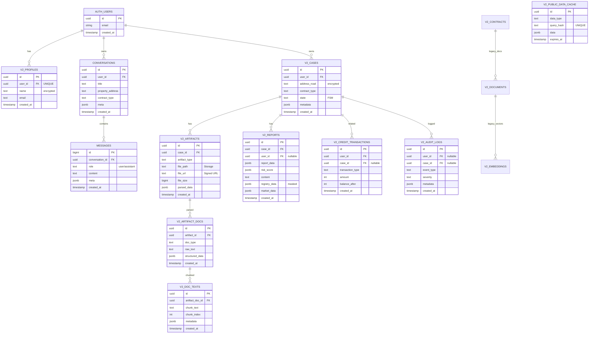

# ZipCheck v2 Complete ERD & Storage Documentation

> **작성일**: 2025-11-06
> **버전**: 2.1 (Complete Update)
> **데이터베이스**: Supabase (PostgreSQL 15 + pgvector)

---

## 📋 목차
1. [개요](#개요)
2. [전체 ERD 다이어그램](#전체-erd-다이어그램)
3. [테이블 상세](#테이블-상세)
4. [Storage 버킷 구조](#storage-버킷-구조)
5. [RLS 정책 요약](#rls-정책-요약)
6. [Foreign Key 관계](#foreign-key-관계)
7. [보안 체크리스트](#보안-체크리스트)

---

## 개요

### 설계 전략
- **v2 prefix 전략**: 모든 테이블에 `v2_` prefix 사용 (v1과 충돌 방지)
- **보안**: Row Level Security (RLS) 활성화로 사용자 데이터 격리
- **확장성**: pgvector 활용한 벡터 검색 지원
- **Storage**: Supabase Storage 버킷으로 파일 관리

### 주요 확장 기능
- `vector` (pgvector): 벡터 임베딩 저장 및 유사도 검색
- `uuid-ossp`: UUID 생성 함수

---

## 전체 ERD 다이어그램



---

## 테이블 상세

### 1. 사용자 & 인증

#### `v2_profiles`
사용자 프로필 정보 (Supabase Auth 연동)

| 컬럼명 | 타입 | NULL | 기본값 | 설명 |
|--------|------|------|--------|------|
| id | UUID | NO | `gen_random_uuid()` | Primary Key |
| user_id | UUID | NO | - | Supabase Auth user ID (UNIQUE) |
| name | TEXT | YES | - | 사용자 이름 (암호화 권장) |
| email | TEXT | YES | - | 이메일 |
| created_at | TIMESTAMPTZ | YES | `NOW()` | 생성일 |
| updated_at | TIMESTAMPTZ | YES | `NOW()` | 수정일 |

**Foreign Keys**:
- `user_id` → `auth.users(id)` (CASCADE DELETE)

**Indexes**:
- PRIMARY KEY: `id`
- UNIQUE: `user_id`

**RLS Policies**:
- SELECT: `user_id = auth.uid()`
- INSERT: `user_id = auth.uid()`
- UPDATE: `user_id = auth.uid()`

---

### 2. 채팅 & 대화

#### `conversations`
대화 세션

| 컬럼명 | 타입 | NULL | 기본값 | 설명 |
|--------|------|------|--------|------|
| id | UUID | NO | `gen_random_uuid()` | Primary Key |
| user_id | UUID | NO | - | 사용자 ID |
| title | TEXT | YES | - | 대화 제목 |
| property_address | TEXT | YES | - | 부동산 주소 |
| contract_type | TEXT | YES | - | 계약 유형 |
| analysis_status | TEXT | YES | - | 분석 상태 |
| meta | JSONB | YES | `{}` | 메타데이터 |
| created_at | TIMESTAMPTZ | YES | `NOW()` | 생성일 |
| updated_at | TIMESTAMPTZ | YES | `NOW()` | 수정일 |

**Foreign Keys**:
- `user_id` → `auth.users(id)` (CASCADE DELETE)

**RLS Policies**:
- All operations: `user_id = auth.uid()`

#### `messages`
대화 메시지

| 컬럼명 | 타입 | NULL | 기본값 | 설명 |
|--------|------|------|--------|------|
| id | BIGINT | NO | `nextval()` | Primary Key |
| conversation_id | UUID | NO | - | 대화 ID |
| role | TEXT | NO | - | `user` or `assistant` |
| content | TEXT | NO | - | 메시지 내용 |
| meta | JSONB | YES | `{}` | 메타데이터 |
| created_at | TIMESTAMPTZ | YES | `NOW()` | 생성일 |

**Foreign Keys**:
- `conversation_id` → `conversations(id)` (CASCADE DELETE)

**RLS Policies**:
- All operations: `conversation_id IN (SELECT id FROM conversations WHERE user_id = auth.uid())`

#### `recent_conversations` (VIEW)
최근 대화 조회용 뷰

```sql
CREATE VIEW recent_conversations
WITH (security_invoker = true) AS
SELECT
    c.id,
    c.user_id,
    c.title,
    c.property_address,
    c.contract_type,
    c.created_at,
    c.updated_at,
    m.content as last_message,
    m.created_at as last_message_at
FROM conversations c
LEFT JOIN LATERAL (
    SELECT content, created_at
    FROM messages
    WHERE conversation_id = c.id
    ORDER BY created_at DESC
    LIMIT 1
) m ON true
WHERE c.user_id = auth.uid()
ORDER BY c.updated_at DESC;
```

⚠️ **SECURITY INVOKER** 필수: RLS 정책 강제 적용

---

### 3. 계약 분석 시스템

#### `v2_cases`
분석 케이스 (FSM 상태 관리)

| 컬럼명 | 타입 | NULL | 기본값 | 설명 |
|--------|------|------|--------|------|
| id | UUID | NO | `uuid_generate_v4()` | Primary Key |
| user_id | UUID | NO | - | 사용자 ID |
| address_road | TEXT | NO | - | 도로명 주소 (암호화 권장) |
| address_lot | TEXT | YES | - | 지번 주소 (암호화 권장) |
| address_dong | TEXT | YES | - | 동 |
| address_ho | TEXT | YES | - | 호 |
| address_detail | JSONB | YES | - | JUSO API 응답 |
| contract_type | TEXT | NO | - | `전세`/`월세`/`전월세`/`매매` |
| contract_amount | BIGINT | YES | - | 보증금 or 매매가 (만원) |
| monthly_rent | BIGINT | YES | - | 월세 (만원) |
| state | TEXT | NO | `'init'` | FSM 상태 |
| flags | JSONB | YES | `{}` | `test_mode` 등 |
| metadata | JSONB | YES | `{}` | 메타데이터 |
| created_at | TIMESTAMPTZ | YES | `NOW()` | 생성일 |
| updated_at | TIMESTAMPTZ | YES | `NOW()` | 수정일 |
| completed_at | TIMESTAMPTZ | YES | - | 완료일 |

**FSM 상태 전환**:
```
init → address_pick → contract_type → registry_choice → registry_ready → parse_enrich → report
```

**Foreign Keys**:
- `user_id` → `auth.users(id)` (CASCADE DELETE)

**Indexes**:
- `idx_v2_cases_user_id`
- `idx_v2_cases_state`
- `idx_v2_cases_created_at` (DESC)

#### `v2_artifacts`
파일 아티팩트 (Storage 연동)

| 컬럼명 | 타입 | NULL | 기본값 | 설명 |
|--------|------|------|--------|------|
| id | UUID | NO | `uuid_generate_v4()` | Primary Key |
| case_id | UUID | NO | - | 케이스 ID |
| artifact_type | TEXT | NO | - | `registry_pdf`/`building_ledger`/`user_upload`/`generated_report` |
| file_path | TEXT | NO | - | Storage 경로 |
| file_url | TEXT | YES | - | Signed URL (만료형) |
| file_name | TEXT | NO | - | 원본 파일명 |
| file_size | BIGINT | NO | - | 파일 크기 (bytes) |
| mime_type | TEXT | NO | - | MIME 타입 |
| parsed_data | JSONB | YES | - | 파싱된 데이터 (JSON) |
| parse_confidence | REAL | YES | - | 파싱 신뢰도 (0~1) |
| parse_method | TEXT | YES | - | `pypdf`/`ocr`/`llm_gemini`/`llm_chatgpt` |
| metadata | JSONB | YES | `{}` | 메타데이터 |
| created_at | TIMESTAMPTZ | YES | `NOW()` | 생성일 |
| updated_at | TIMESTAMPTZ | YES | `NOW()` | 수정일 |

**Foreign Keys**:
- `case_id` → `v2_cases(id)` (CASCADE DELETE)

**Indexes**:
- `idx_v2_artifacts_case_id`
- `idx_v2_artifacts_type`

#### `v2_artifact_docs`
파싱된 문서 (텍스트 추출)

| 컬럼명 | 타입 | NULL | 기본값 | 설명 |
|--------|------|------|--------|------|
| id | UUID | NO | `uuid_generate_v4()` | Primary Key |
| artifact_id | UUID | NO | - | 아티팩트 ID |
| doc_type | TEXT | NO | - | `raw_text`/`structured_json` |
| raw_text | TEXT | YES | - | 추출된 텍스트 |
| structured_data | JSONB | YES | - | 구조화된 데이터 |
| metadata | JSONB | YES | `{}` | 메타데이터 |
| created_at | TIMESTAMPTZ | YES | `NOW()` | 생성일 |

**Foreign Keys**:
- `artifact_id` → `v2_artifacts(id)` (CASCADE DELETE)

#### `v2_doc_texts`
문서 청크 (벡터 검색용)

| 컬럼명 | 타입 | NULL | 기본값 | 설명 |
|--------|------|------|--------|------|
| id | UUID | NO | `uuid_generate_v4()` | Primary Key |
| artifact_doc_id | UUID | NO | - | 문서 ID |
| chunk_text | TEXT | NO | - | 청크 텍스트 |
| chunk_index | INTEGER | NO | - | 청크 순서 |
| metadata | JSONB | YES | `{}` | 페이지, 오프셋 등 |
| created_at | TIMESTAMPTZ | YES | `NOW()` | 생성일 |

**Foreign Keys**:
- `artifact_doc_id` → `v2_artifact_docs(id)` (CASCADE DELETE)

#### `v2_reports`
분석 리포트

| 컬럼명 | 타입 | NULL | 기본값 | 설명 |
|--------|------|------|--------|------|
| id | UUID | NO | `uuid_generate_v4()` | Primary Key |
| case_id | UUID | NO | - | 케이스 ID |
| user_id | UUID | YES | - | 사용자 ID (nullable) ⚠️ |
| version | INTEGER | NO | 1 | 리포트 버전 |
| report_data | JSONB | NO | - | 전체 리포트 JSON |
| final_summary | TEXT | YES | - | 채팅형 요약 |
| risk_score | JSONB | YES | - | 리스크 점수 객체 |
| risk_band | TEXT | YES | - | `LOW`/`MID`/`HIGH`/`VHIGH` |
| content | TEXT | YES | - | LLM 생성 내용 |
| registry_data | JSONB | YES | - | 마스킹된 등기부 정보 |
| market_data | JSONB | YES | - | 시장 데이터 (매매 전용) |
| llm_model_draft | TEXT | YES | - | 초안 모델 (`gpt-4o-mini`) |
| llm_model_review | TEXT | YES | - | 검증 모델 (`claude-sonnet-4`) |
| llm_tokens_used | INTEGER | YES | - | 총 토큰 사용량 |
| generation_time_ms | INTEGER | YES | - | 생성 시간 (ms) |
| metadata | JSONB | YES | `{}` | 메타데이터 |
| created_at | TIMESTAMPTZ | YES | `NOW()` | 생성일 |

⚠️ **user_id nullable**: 기존 데이터 호환성 때문에 nullable이지만, 신규 리포트는 반드시 user_id 입력 필요

**Foreign Keys**:
- `case_id` → `v2_cases(id)` (CASCADE DELETE)
- `user_id` → `auth.users(id)` (CASCADE DELETE) - 선택적

**Indexes**:
- `idx_v2_reports_case_id`
- `idx_v2_reports_version` (case_id, version DESC)
- `idx_v2_reports_risk_band`
- `idx_v2_reports_user_id` (WHERE user_id IS NOT NULL)

---

### 4. 크레딧 & 감사 로그

#### `v2_credit_transactions`
크레딧 트랜잭션

| 컬럼명 | 타입 | NULL | 기본값 | 설명 |
|--------|------|------|--------|------|
| id | UUID | NO | `uuid_generate_v4()` | Primary Key |
| user_id | UUID | NO | - | 사용자 ID |
| case_id | UUID | YES | - | 케이스 ID (nullable) |
| transaction_type | TEXT | NO | - | `purchase`/`deduct`/`refund`/`bonus`/`expire` |
| amount | INTEGER | NO | - | 크레딧 수량 (음수: 차감, 양수: 증가) |
| balance_after | INTEGER | NO | - | 트랜잭션 후 잔액 |
| reason | TEXT | NO | - | 트랜잭션 사유 |
| reason_code | TEXT | YES | - | 사유 코드 |
| metadata | JSONB | YES | `{}` | 결제 정보 등 |
| created_at | TIMESTAMPTZ | YES | `NOW()` | 생성일 |

**Foreign Keys**:
- `user_id` → `auth.users(id)` (CASCADE DELETE)
- `case_id` → `v2_cases(id)` (SET NULL)

**Indexes**:
- `idx_v2_credit_txns_user_id`
- `idx_v2_credit_txns_case_id`
- `idx_v2_credit_txns_created_at` (DESC)

#### `v2_audit_logs`
감사 로그

| 컬럼명 | 타입 | NULL | 기본값 | 설명 |
|--------|------|------|--------|------|
| id | UUID | NO | `uuid_generate_v4()` | Primary Key |
| user_id | UUID | YES | - | 사용자 ID (nullable) |
| case_id | UUID | YES | - | 케이스 ID (nullable) |
| event_type | TEXT | NO | - | `case_created`/`pdf_parsed` 등 |
| event_category | TEXT | YES | - | `case`/`registry`/`parsing`/`llm`/`error` |
| message | TEXT | NO | - | 이벤트 메시지 |
| severity | TEXT | NO | `'info'` | `debug`/`info`/`warning`/`error`/`critical` |
| metadata | JSONB | YES | `{}` | 추가 정보 |
| created_at | TIMESTAMPTZ | YES | `NOW()` | 생성일 |

**Foreign Keys**:
- `user_id` → `auth.users(id)` (SET NULL)
- `case_id` → `v2_cases(id)` (SET NULL)

**Indexes**:
- `idx_v2_audit_logs_user_id`
- `idx_v2_audit_logs_case_id`
- `idx_v2_audit_logs_event_type`
- `idx_v2_audit_logs_created_at` (DESC)

#### `v2_public_data_cache`
공공 데이터 캐시

| 컬럼명 | 타입 | NULL | 기본값 | 설명 |
|--------|------|------|--------|------|
| id | UUID | NO | `uuid_generate_v4()` | Primary Key |
| data_type | TEXT | NO | - | `building_ledger`/`real_estate_trade`/`similar_property`/`auction` |
| query_params | JSONB | NO | - | 쿼리 파라미터 |
| query_hash | TEXT | NO | - | 파라미터 해시 (UNIQUE) |
| data | JSONB | NO | - | 캐시된 데이터 |
| data_source | TEXT | NO | - | 데이터 출처 |
| hit_count | INTEGER | NO | 0 | 캐시 히트 횟수 |
| expires_at | TIMESTAMPTZ | NO | - | 만료 시간 |
| created_at | TIMESTAMPTZ | YES | `NOW()` | 생성일 |
| last_accessed_at | TIMESTAMPTZ | YES | `NOW()` | 마지막 접근 |

**Indexes**:
- `idx_v2_public_data_cache_type`
- `idx_v2_public_data_cache_hash` (UNIQUE)
- `idx_v2_public_data_cache_expires`

---

### 5. Legacy 테이블 (v2 초기 설계)

#### `v2_contracts` (Legacy)
계약서 메타데이터 (현재는 v2_cases 사용)

| 컬럼명 | 타입 | NULL | 기본값 | 설명 |
|--------|------|------|--------|------|
| id | UUID | NO | `gen_random_uuid()` | Primary Key |
| user_id | UUID | NO | - | 사용자 ID |
| contract_id | TEXT | NO | - | 계약서 고유 ID (UNIQUE) |
| addr | TEXT | YES | - | 부동산 주소 (암호화 권장) |
| status | TEXT | YES | `'processing'` | `processing`/`completed`/`failed` |
| created_at | TIMESTAMPTZ | YES | `NOW()` | 생성일 |
| updated_at | TIMESTAMPTZ | YES | `NOW()` | 수정일 |

**Foreign Keys**:
- `user_id` → `auth.users(id)` (CASCADE DELETE)

---

## Storage 버킷 구조

### Supabase Storage 버킷

#### 1. `artifacts` (Private)
등기부, 계약서, 리포트 PDF 저장

**버킷 설정**:
```json
{
  "public": false,
  "fileSizeLimit": 52428800,
  "allowedMimeTypes": [
    "application/pdf",
    "image/jpeg",
    "image/png"
  ]
}
```

**경로 구조**:
```
artifacts/
├── {user_id}/
│   ├── {case_id}/
│   │   ├── registry_{timestamp}.pdf
│   │   ├── building_ledger_{timestamp}.pdf
│   │   ├── user_upload_{filename}
│   │   └── report_{version}.pdf
```

**RLS 정책**:
```sql
-- SELECT: 본인 파일만 조회
CREATE POLICY "Users can view own artifacts"
ON storage.objects FOR SELECT
USING (bucket_id = 'artifacts' AND auth.uid()::text = (storage.foldername(name))[1]);

-- INSERT: 본인 폴더에만 업로드
CREATE POLICY "Users can upload to own folder"
ON storage.objects FOR INSERT
WITH CHECK (bucket_id = 'artifacts' AND auth.uid()::text = (storage.foldername(name))[1]);

-- DELETE: 본인 파일만 삭제
CREATE POLICY "Users can delete own artifacts"
ON storage.objects FOR DELETE
USING (bucket_id = 'artifacts' AND auth.uid()::text = (storage.foldername(name))[1]);
```

**Signed URL 사용**:
```python
# FastAPI - core/supabase_client.py
def get_signed_url(file_path: str, expires_in: int = 3600) -> str:
    """
    Private 버킷 파일의 서명된 URL 생성

    Args:
        file_path: Storage 경로 (예: "user_id/case_id/file.pdf")
        expires_in: 만료 시간 (초, 기본 1시간)

    Returns:
        서명된 URL (만료형)
    """
    supabase = get_supabase_client()
    response = supabase.storage.from_("artifacts").create_signed_url(
        file_path,
        expires_in=expires_in
    )
    return response["signedURL"]
```

**Next.js 업로드 예시**:
```typescript
// apps/web/lib/uploadToStorage.ts
import { getBrowserSupabase } from './supabaseBrowser';

export async function uploadArtifact(
  userId: string,
  caseId: string,
  file: File,
  artifactType: string
): Promise<string> {
  const supabase = getBrowserSupabase();

  const timestamp = Date.now();
  const fileName = `${artifactType}_${timestamp}_${file.name}`;
  const filePath = `${userId}/${caseId}/${fileName}`;

  const { data, error } = await supabase.storage
    .from('artifacts')
    .upload(filePath, file);

  if (error) throw error;

  return filePath;
}
```

#### 2. `public-assets` (Public)
공개 자산 (로고, 이미지 등)

**버킷 설정**:
```json
{
  "public": true,
  "fileSizeLimit": 10485760,
  "allowedMimeTypes": [
    "image/jpeg",
    "image/png",
    "image/svg+xml",
    "image/webp"
  ]
}
```

**경로 구조**:
```
public-assets/
├── logos/
│   ├── logo.svg
│   └── logo-dark.svg
├── images/
│   ├── hero-banner.jpg
│   └── placeholder.png
└── icons/
    └── favicon.ico
```

**접근 방법**:
```typescript
// 공개 URL (서명 불필요)
const publicUrl = supabase.storage
  .from('public-assets')
  .getPublicUrl('logos/logo.svg').data.publicUrl;
```

---

## RLS 정책 요약

### 기본 원칙
1. **모든 테이블에서 RLS 활성화**
2. **사용자는 본인 데이터만 접근** (`auth.uid() = user_id`)
3. **케이스 관련 테이블은 케이스 소유권으로 접근 제어**
4. **Storage도 RLS 적용** (본인 폴더만 접근)

### 주요 패턴

#### 직접 소유권
```sql
-- v2_profiles, conversations, v2_cases 등
CREATE POLICY "Users can view own data"
ON table_name FOR SELECT
USING (user_id = auth.uid());
```

#### 간접 소유권 (서브쿼리)
```sql
-- v2_artifacts, v2_reports 등
CREATE POLICY "Users can view artifacts of their cases"
ON v2_artifacts FOR SELECT
USING (EXISTS (
    SELECT 1 FROM v2_cases
    WHERE v2_cases.id = v2_artifacts.case_id
    AND v2_cases.user_id = auth.uid()
));
```

#### VIEW 보안
```sql
-- recent_conversations VIEW
CREATE VIEW recent_conversations
WITH (security_invoker = true) AS  -- ⚠️ 필수!
SELECT ...
WHERE c.user_id = auth.uid();
```

⚠️ **SECURITY INVOKER 필수**: SECURITY DEFINER를 사용하면 RLS가 무시되어 보안 취약점 발생

---

## Foreign Key 관계

### 관계 맵

```
auth.users (Supabase Auth)
    │
    ├──► v2_profiles (CASCADE DELETE)
    ├──► conversations (CASCADE DELETE)
    │       └──► messages (CASCADE DELETE)
    │
    ├──► v2_cases (CASCADE DELETE)
    │       ├──► v2_artifacts (CASCADE DELETE)
    │       │       └──► v2_artifact_docs (CASCADE DELETE)
    │       │               └──► v2_doc_texts (CASCADE DELETE)
    │       │
    │       ├──► v2_reports (CASCADE DELETE)
    │       ├──► v2_credit_transactions (SET NULL on case_id)
    │       └──► v2_audit_logs (SET NULL)
    │
    └──► v2_contracts (CASCADE DELETE) - Legacy
            └──► v2_documents (CASCADE DELETE) - Legacy
                    └──► v2_embeddings (CASCADE DELETE) - Legacy
```

### CASCADE vs SET NULL 전략

**CASCADE DELETE** (강한 종속성):
- `v2_profiles`, `conversations`, `v2_cases` → `auth.users`
- `messages` → `conversations`
- `v2_artifacts` → `v2_cases`
- `v2_reports` → `v2_cases`

사용자 또는 케이스 삭제 시 관련 데이터 모두 삭제

**SET NULL** (약한 종속성):
- `v2_credit_transactions.case_id` → `v2_cases`
- `v2_audit_logs.user_id`, `v2_audit_logs.case_id` → `auth.users`, `v2_cases`

히스토리 데이터 보존 (감사 추적)

---

## 보안 체크리스트

### Database
- [x] RLS 활성화 (모든 테이블)
- [x] `recent_conversations` 뷰: `SECURITY INVOKER` 모드
- [x] 개인정보 암호화 권장 (`v2_profiles.name`, `v2_cases.address_*`)
- [x] Foreign Key CASCADE DELETE 설정
- [x] 인덱스 최적화 (`user_id`, `created_at`)
- [x] 감사 로그 시스템 활성화
- [x] `v2_reports.user_id` nullable → 신규 리포트는 필수 입력

### Storage
- [x] `artifacts` 버킷: Private (RLS 적용)
- [x] Signed URL 사용 (만료 1시간)
- [x] 파일 크기 제한 (50MB)
- [x] MIME 타입 검증
- [x] 사용자별 폴더 격리 (`{user_id}/{case_id}/`)

### API
- [x] JWT 토큰 검증 (middleware)
- [x] `user["sub"]` 표준화 (`id`/`sub`/`user_id` 통일)
- [x] Authorization 헤더 필수
- [x] RLS 우회 방지 (Service Role Key는 서버 전용)

### Production
- [ ] Environment variables 보안 (GCP Secret Manager)
- [ ] Rate limiting 설정
- [ ] CORS 정책 강화 (운영 도메인만 허용)
- [ ] SSL/TLS 인증서 검증
- [ ] 정기적인 보안 감사

---

## 참고 문서

- [Supabase RLS 가이드](https://supabase.com/docs/guides/auth/row-level-security)
- [Supabase Storage 가이드](https://supabase.com/docs/guides/storage)
- [pgvector 문서](https://github.com/pgvector/pgvector)
- [PostgreSQL SECURITY DEFINER/INVOKER](https://www.postgresql.org/docs/current/sql-createfunction.html)
- [ZipCheck v2 CLAUDE.md](../CLAUDE.md)

---

**작성자**: Backend Team
**최종 수정**: 2025-11-06 (로그인 타이밍 이슈 해결 후)
**Git Revision**: `zipcheck-ai-00071-l2s`
