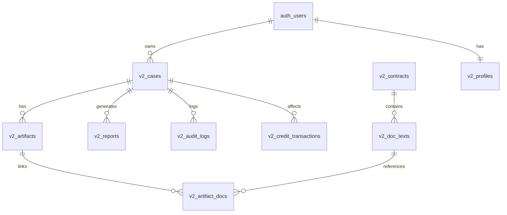

# 📊 집체크 데이터베이스 아키텍처 (V2)

> **작성일**: 2025-01-30
> **백엔드 전문가**: 30년 경력 아키텍트 분석

---

## 🏗️ 전체 아키텍처 개요

### 핵심 구성요소
```
┌─────────────────────────────────────────────────────────────────┐
│                    Supabase Cloud Platform                       │
│                                                                   │
│  ┌─────────────────┐  ┌──────────────────┐  ┌────────────────┐ │
│  │   PostgreSQL    │  │  Storage API     │  │   Auth API     │ │
│  │   (17.4)        │  │  (Private)       │  │   (JWT)        │ │
│  │                 │  │                  │  │                │ │
│  │  - v2_* tables  │  │  - artifacts/    │  │  - auth.users  │ │
│  │  - RLS 정책     │  │    {user_id}/    │  │  - sessions    │ │
│  │  - Indexes      │  │    {case_id}/    │  │  - OAuth       │ │
│  │  - FK 관계      │  │    {filename}    │  │                │ │
│  └─────────────────┘  └──────────────────┘  └────────────────┘ │
│                                                                   │
│  ┌─────────────────────────────────────────────────────────────┐ │
│  │               Row Level Security (RLS)                       │ │
│  │  - auth.uid() 기반 사용자 데이터 격리                        │ │
│  │  - service_role 예외 (백엔드 파이프라인)                    │ │
│  │  - SECURITY INVOKER 모드 (뷰)                               │ │
│  └─────────────────────────────────────────────────────────────┘ │
└─────────────────────────────────────────────────────────────────┘
```

---

## 📋 테이블 구조 상세

### 1. 핵심 엔티티 (Core Entities)

#### 🏠 `v2_cases` - 분석 케이스 (중심 테이블)
**목적**: 부동산 분석 요청의 생명주기 관리

| 컬럼 | 타입 | 제약 | 설명 |
|------|------|------|------|
| `id` | uuid | PK | 케이스 고유 ID |
| `user_id` | uuid | NOT NULL, FK(auth.users) | 소유자 (RLS 기준) |
| `property_address` | text | NULL | 부동산 주소 (통합 주소) |
| `address_road` | text | NOT NULL | 도로명 주소 |
| `address_lot` | text | NULL | 지번 주소 |
| `address_dong` | text | NULL | 동 정보 |
| `address_ho` | text | NULL | 호수 정보 |
| `address_detail` | jsonb | NULL | 주소 상세 정보 |
| `contract_type` | text | NULL | 계약 유형 (매매/전세/월세) |
| `contract_amount` | bigint | NULL | 계약 금액 (원) |
| `monthly_rent` | bigint | NULL | 월세 (원) |
| **`current_state`** | text | NOT NULL | **현재 상태** (FSM) |
| `flags` | jsonb | DEFAULT '{}' | 플래그 비트마스크 |
| `metadata` | jsonb | DEFAULT '{}' | 확장 메타데이터 |
| `created_at` | timestamptz | DEFAULT now() | 생성 시각 |
| `updated_at` | timestamptz | DEFAULT now() | 수정 시각 |
| `completed_at` | timestamptz | NULL | 완료 시각 |

**상태 전이 (FSM)**:
```
init → address_pick → contract_type → registry_choice
→ registry_ready → parse_enrich → report → completed
```

**인덱스**:
- `idx_v2_cases_user_id` - 사용자별 케이스 조회
- `idx_v2_cases_current_state` - 상태별 필터링
- `idx_v2_cases_property_address` - 주소 검색
- `idx_v2_cases_created_at` - 시간순 정렬

**RLS 정책**:
- ✅ `Users can view own cases (SELECT)` - `auth.uid() = user_id`
- ✅ `Users can create own cases (INSERT)` - `auth.uid() = user_id`
- ✅ `Users can update own cases (UPDATE)` - `auth.uid() = user_id`
- ✅ `Users can delete own cases (DELETE)` - `auth.uid() = user_id`
- ⚠️ `Admins can view all cases (SELECT)` - 관리자 전용

---

#### 📄 `v2_artifacts` - 업로드된 파일 (등기부, 계약서)
**목적**: 사용자 업로드 파일 및 파싱 결과 관리

| 컬럼 | 타입 | 제약 | 설명 |
|------|------|------|------|
| `id` | uuid | PK | 아티팩트 ID |
| `case_id` | uuid | NOT NULL, FK(v2_cases) | 소속 케이스 |
| `user_id` | uuid | NULL, FK(auth.users) | 업로더 |
| `artifact_type` | text | NOT NULL | 파일 종류 (registry_pdf, contract_pdf) |
| `file_path` | text | NOT NULL | Storage 경로 (deprecated) |
| **`file_url`** | text | NULL | **Storage 서명 URL** |
| `file_name` | text | NOT NULL | 원본 파일명 |
| `file_size` | bigint | NOT NULL | 파일 크기 (bytes) |
| `mime_type` | text | NOT NULL | MIME 타입 |
| `hash_sha256` | text | UNIQUE | SHA-256 해시 (중복 방지) |
| **`parsed_data`** | jsonb | NULL | **파싱된 구조화 데이터** |
| `parse_confidence` | real | NULL | 파싱 신뢰도 (0.0~1.0) |
| `parse_method` | text | NULL | 파싱 방법 (regex/gemini_ocr) |
| `metadata` | jsonb | DEFAULT '{}' | 추가 메타데이터 |
| `created_at` | timestamptz | DEFAULT now() | 업로드 시각 |
| `updated_at` | timestamptz | DEFAULT now() | 수정 시각 |
| `deleted_at` | timestamptz | NULL | 소프트 삭제 |
| `created_by` | uuid | NULL | 생성자 ID |

**인덱스**:
- `idx_v2_artifacts_case_id` - 케이스별 파일 조회
- `idx_v2_artifacts_type` - 파일 타입별 필터
- `idx_v2_artifacts_user_id` - 사용자별 파일
- `idx_v2_artifacts_hash_unique` - 중복 방지
- `idx_v2_artifacts_deleted_at` - 소프트 삭제 필터

**Storage 연계**:
```
Supabase Storage: artifacts (Private)
└─ {user_id}/
   └─ {case_id}/
      └─ {timestamp}-{filename}.pdf
```

**RLS 정책**:
- ✅ `Users can view artifacts of their cases` - JOIN v2_cases
- ✅ `Users can insert artifacts for their cases`
- ✅ `Users can delete artifacts of own cases`

---

#### 📊 `v2_reports` - 분석 리포트
**목적**: 최종 분석 결과 저장 및 버전 관리

| 컬럼 | 타입 | 제약 | 설명 |
|------|------|------|------|
| `id` | uuid | PK | 리포트 ID |
| `case_id` | uuid | NOT NULL, FK(v2_cases) | 소속 케이스 |
| `user_id` | uuid | NULL | 소유자 |
| `version` | integer | DEFAULT 1 | 리포트 버전 |
| **`content`** | text | NULL | **LLM 최종 답변 (마크다운)** |
| **`report_data`** | jsonb | NOT NULL | **구조화된 리포트 데이터** |
| **`risk_score`** | jsonb | NULL | **리스크 점수 상세** |
| `risk_band` | text | NULL | 리스크 밴드 (안전/주의/위험/심각) |
| **`registry_data`** | jsonb | NULL | **마스킹된 등기부 정보** |
| `market_data` | jsonb | NULL | 시장 데이터 (매매 전용) |
| `final_summary` | text | NULL | 요약 (레거시) |
| `llm_model_draft` | text | NULL | 초안 모델 (gpt-4o-mini) |
| `llm_model_review` | text | NULL | 검증 모델 (claude-3-5-sonnet) |
| `llm_tokens_used` | integer | NULL | 사용 토큰 수 |
| `generation_time_ms` | integer | NULL | 생성 소요 시간 |
| `metadata` | jsonb | DEFAULT '{}' | 추가 메타데이터 |
| `created_at` | timestamptz | DEFAULT now() | 생성 시각 |

**리포트 구조 (`report_data` JSONB)**:
```json
{
  "summary": "LLM 최종 답변 (content와 동일)",
  "risk": {
    "total_score": 45.0,
    "risk_level": "주의",
    "jeonse_ratio": 83.3,
    "mortgage_ratio": 16.7,
    "risk_factors": ["전세가율 83.3% (위험)", "근저당 비율 16.7%"]
  },
  "registry": {
    "owner": {"name": "홍XX", "share_ratio": "1/1"},
    "mortgages": [{"creditor": "하나캐피탈", "amount": 10000}],
    "seizures": []
  },
  "market": {
    "avg_trade_price": 75000,
    "recent_trades": []
  }
}
```

**인덱스**:
- `idx_v2_reports_case_id` - 케이스별 리포트 조회
- `idx_v2_reports_user_id` - 사용자별 리포트
- `idx_v2_reports_version` - 버전 정렬
- `idx_v2_reports_risk_band` - 리스크 등급 필터

**RLS 정책**:
- ✅ `Users can view reports of their cases` - JOIN v2_cases

---

### 2. 지원 엔티티 (Supporting Entities)

#### 📝 `v2_doc_texts` - 문서 텍스트 (RAG용)
**목적**: 등기부/계약서 원문 저장 및 검색

| 컬럼 | 타입 | 설명 |
|------|------|------|
| `id` | uuid | 문서 ID |
| `contract_id` | uuid | FK(v2_contracts) |
| `user_id` | uuid | 소유자 |
| `document_type` | text | 문서 타입 (registry/contract) |
| `text` | text | 원문 텍스트 |
| `text_length` | integer | 텍스트 길이 |
| `property_address` | text | 암호화된 주소 |
| `owner_info` | jsonb | 암호화된 소유자 정보 |
| `registry_date` | date | 등기부 발급일 |
| `source_kind` | text | 소스 종류 |
| `source_ref_id` | uuid | 소스 참조 ID |
| `lang` | text | 언어 (ko) |
| `page_range` | text | 페이지 범위 |
| `section_label` | text | 섹션 라벨 |
| `version` | integer | 버전 |
| `created_at` | timestamptz | 생성 시각 |
| `updated_at` | timestamptz | 수정 시각 |

**전문 검색 인덱스**:
- `idx_v2_doc_texts_gin_text` - GIN 인덱스 (전문 검색)
- `idx_v2_doc_texts_gin_owner_info` - JSONB GIN 인덱스

---

#### 💳 `v2_credit_transactions` - 크레딧 거래 내역
**목적**: 사용자 크레딧 시스템 (향후 구현)

| 컬럼 | 타입 | 설명 |
|------|------|------|
| `id` | uuid | 거래 ID |
| `user_id` | uuid | 사용자 |
| `case_id` | uuid | 관련 케이스 (NULL 가능) |
| `transaction_type` | text | 거래 유형 (charge/consume/refund) |
| `amount` | integer | 거래 금액 |
| `balance_after` | integer | 잔액 |
| `reason` | text | 사유 |
| `reason_code` | text | 사유 코드 |
| `metadata` | jsonb | 추가 정보 |
| `created_at` | timestamptz | 거래 시각 |

**RLS**: 사용자별 격리 (`auth.uid() = user_id`)

---

#### 📜 `v2_audit_logs` - 감사 로그
**목적**: 보안 및 디버깅용 이벤트 추적

| 컬럼 | 타입 | 설명 |
|------|------|------|
| `id` | uuid | 로그 ID |
| `user_id` | uuid | 사용자 |
| `case_id` | uuid | 케이스 |
| `event_type` | text | 이벤트 타입 |
| `event_category` | text | 카테고리 |
| `message` | text | 메시지 |
| `severity` | text | 심각도 (info/warn/error) |
| `metadata` | jsonb | 추가 정보 |
| `created_at` | timestamptz | 발생 시각 |

**인덱스**:
- `idx_v2_audit_logs_user_id` - 사용자별 로그
- `idx_v2_audit_logs_case_id` - 케이스별 로그
- `idx_v2_audit_logs_event_type` - 이벤트 타입 필터
- `idx_v2_audit_logs_created_at` - 시간순 정렬

---

#### 🌐 `v2_public_data_cache` - 공공데이터 캐시
**목적**: API 호출 비용 절감 및 성능 개선

| 컬럼 | 타입 | 설명 |
|------|------|------|
| `id` | uuid | 캐시 ID |
| `data_type` | text | 데이터 타입 (apt_trade/legal_dong) |
| `query_params` | jsonb | 쿼리 파라미터 |
| `query_hash` | text | UNIQUE, 쿼리 해시 |
| `data` | jsonb | 캐시된 데이터 |
| `data_source` | text | 데이터 소스 |
| `hit_count` | integer | 조회 횟수 |
| `expires_at` | timestamptz | 만료 시각 |
| `created_at` | timestamptz | 생성 시각 |
| `last_accessed_at` | timestamptz | 마지막 조회 |

**인덱스**:
- `idx_v2_public_data_cache_hash` - 해시 기반 조회
- `idx_v2_public_data_cache_type` - 타입별 필터
- `idx_v2_public_data_cache_expires` - 만료 데이터 정리

**RLS**:
- ✅ `Authenticated users can read` - 읽기 전용
- ✅ `Service role can insert/update/delete` - 백엔드 관리

---

#### 👤 `v2_profiles` - 사용자 프로필
**목적**: 암호화된 개인정보 저장

| 컬럼 | 타입 | 설명 |
|------|------|------|
| `id` | uuid | 프로필 ID |
| `user_id` | uuid | UNIQUE, FK(auth.users) |
| `name` | text | 암호화된 이름 |
| `email` | text | 암호화된 이메일 |
| `created_at` | timestamptz | 생성 시각 |
| `updated_at` | timestamptz | 수정 시각 |

**암호화**: AES-256-GCM (환경변수 `ENCRYPTION_KEY`)

**RLS**:
- ✅ `Users can view their own profile` - `auth.uid() = user_id`
- ✅ `Users can update their own profile`

---

### 3. 레거시 테이블 (V1 호환성)

#### 📄 `v2_contracts` - 레거시 계약서 (V1 호환)
| 컬럼 | 타입 | 설명 |
|------|------|------|
| `id` | uuid | 계약 ID |
| `user_id` | uuid | 사용자 |
| `contract_id` | text | UNIQUE, 계약 고유 ID |
| `addr` | text | 주소 |
| `status` | text | 상태 (processing/completed) |
| `created_at` | timestamptz | 생성 시각 |
| `updated_at` | timestamptz | 수정 시각 |

**RLS**: 사용자별 격리

---

## 🔗 외래키 관계 (Foreign Keys)



**관계 상세**:
1. **v2_cases** (1) → (N) **v2_artifacts**: 케이스당 여러 파일 업로드 가능
2. **v2_cases** (1) → (N) **v2_reports**: 버전 관리 (재분석 시 새 버전)
3. **v2_artifacts** (N) ↔ (N) **v2_doc_texts**: 조인 테이블 `v2_artifact_docs`
4. **auth.users** (1) → (N) **v2_cases**: 사용자별 케이스 소유

---

## 🔒 보안 아키텍처

### Row Level Security (RLS)

**핵심 원칙**:
1. **모든 v2_* 테이블은 RLS 활성화** 필수
2. **auth.uid() = user_id** 조건으로 사용자 데이터 격리
3. **service_role** 예외: 백엔드 파이프라인 전용
4. **관리자 정책**: 별도 역할 기반 접근 제어

**RLS 정책 예시 (v2_cases)**:
```sql
-- 사용자는 본인 케이스만 조회
CREATE POLICY "Users can view own cases"
ON v2_cases FOR SELECT
USING (auth.uid() = user_id);

-- 관리자는 모든 케이스 조회 (향후 구현)
CREATE POLICY "Admins can view all cases"
ON v2_cases FOR SELECT
USING (
  auth.jwt() ->> 'role' = 'admin'
);
```

**Service Role 사용 사례**:
- ✅ 분석 파이프라인 (`execute_analysis_pipeline`)
- ✅ 공공데이터 캐시 관리
- ✅ 배치 작업 (만료 데이터 정리)

---

### 데이터 암호화

**암호화 대상**:
- ✅ `v2_profiles.name` - 이름
- ✅ `v2_profiles.email` - 이메일
- ✅ `v2_doc_texts.property_address` - 주소
- ✅ `v2_doc_texts.owner_info` - 소유자 정보

**암호화 방식**:
- 알고리즘: **AES-256-GCM**
- 키 파생: **PBKDF2-HMAC-SHA256** (100,000 iterations)
- 키 관리: 환경변수 `ENCRYPTION_KEY` (GCP Secret Manager)

**암호화 라이브러리**:
- Python: `cryptography==42.0.0` ([services/ai/core/encryption.py](../../services/ai/core/encryption.py))
- TypeScript: `crypto` (Node.js built-in) ([apps/web/lib/encryption.ts](../../apps/web/lib/encryption.ts))

---

### 마스킹 전략

**개인정보 마스킹** (등기부 파싱):
```python
# services/ai/ingest/registry_parser.py
def mask_personal_name(name: str) -> str:
    """
    개인 이름 마스킹: 홍길동 → 홍XX
    기업명 (캐피탈, 은행): 그대로 표시
    """
    if any(kw in name for kw in ['캐피탈', '은행', '금융']):
        return name  # 기업명은 마스킹 안 함

    return name[0] + 'X' * (len(name) - 1)
```

**저장 전략**:
- **내부 분석용**: 원본 데이터 (파이프라인 내부)
- **유저 표시용**: 마스킹된 데이터 (`v2_reports.registry_data`)

---

## 📦 Supabase Storage 구조

### Bucket: `artifacts` (Private)

**경로 템플릿**:
```
artifacts/
└─ {user_id}/               # UUID (auth.users.id)
   └─ {case_id}/            # UUID (v2_cases.id)
      └─ {timestamp}-{filename}.pdf
```

**예시**:
```
artifacts/
├─ 259154b5-e294-4dd5-a0c6-1f80ea6d462e/  # user_id
│  ├─ 4e306649-2402-4b59-b659-719fa790c47c/  # case_id
│  │  └─ 1763451730400-test.pdf
│  └─ 9b0faccc-89f0-4260-aca5-68eea50211a5/
│     └─ 1763450336500-test.pdf
└─ db5417b0-2e15-4484-bebc-96795279cfd1/
   ├─ 085031aa-f198-497b-9853-589cc8a9837b/
   │  └─ 1763352941602-test.pdf
   └─ 115fd9c2-8251-487f-9521-5bae40250f41/
      └─ 1763457318250-test.pdf
```

**보안 정책**:
- ✅ **Private Bucket**: 외부 직접 접근 불가
- ✅ **서명 URL**: 만료형 URL로만 다운로드 (기본 1시간)
- ✅ **RLS 연계**: `v2_artifacts` 테이블 RLS로 접근 제어

**Storage API 사용**:
```python
# services/ai/core/supabase_client.py
def get_signed_url(bucket: str, path: str, expires_in: int = 3600):
    """
    서명 URL 생성

    Args:
        bucket: 버킷 이름 (artifacts)
        path: 파일 경로 ({user_id}/{case_id}/{filename})
        expires_in: 만료 시간 (초, 기본 1시간)

    Returns:
        str: 서명된 URL
    """
    return supabase.storage.from_(bucket).create_signed_url(
        path, expires_in
    )['signedURL']
```

---

## 📊 인덱스 전략

### 성능 최적화 인덱스

**조회 성능 (SELECT)**:
- `idx_v2_cases_user_id` - 사용자별 케이스 조회 (가장 빈번)
- `idx_v2_artifacts_case_id` - 케이스별 파일 조회
- `idx_v2_reports_case_id` - 케이스별 리포트 조회

**필터링 (WHERE)**:
- `idx_v2_cases_current_state` - 상태별 필터링 (parse_enrich, report 등)
- `idx_v2_artifacts_type` - 파일 타입별 필터 (registry_pdf, contract_pdf)
- `idx_v2_reports_risk_band` - 리스크 등급 필터

**정렬 (ORDER BY)**:
- `idx_v2_cases_created_at` - 최신순 정렬
- `idx_v2_audit_logs_created_at` - 로그 시간순 정렬

**전문 검색 (Full-Text Search)**:
- `idx_v2_doc_texts_gin_text` - GIN 인덱스 (텍스트 검색)
- `idx_v2_doc_texts_gin_owner_info` - JSONB GIN 인덱스

**중복 방지 (UNIQUE)**:
- `v2_artifacts_hash_sha256_key` - SHA-256 해시 (파일 중복 방지)
- `v2_public_data_cache_query_hash_key` - 쿼리 해시 (캐시 중복 방지)

---

## 🔄 분석 파이프라인 흐름

### 데이터 플로우 (End-to-End)

```
1️⃣ 케이스 생성 (v2_cases)
    ↓
    current_state: init → address_pick → contract_type → registry_choice

2️⃣ 등기부 업로드 (v2_artifacts)
    ↓
    Storage: artifacts/{user_id}/{case_id}/{timestamp}-{filename}.pdf
    ↓
    file_url 생성 (서명 URL)
    ↓
    current_state: registry_ready

3️⃣ 파싱 시작 (parse_enrich)
    ↓
    parse_registry_from_url(file_url)
    ↓
    정규식 기반 파싱 (LLM 없음, hallucination 제거)
    ↓
    v2_artifacts.parsed_data 업데이트
    ↓
    개인정보 마스킹 (홍길동 → 홍XX)

4️⃣ 공공데이터 수집
    ↓
    법정동코드 조회 (LegalDongCodeAPIClient)
    ↓
    실거래가 조회 (AptTradeAPIClient)
    ↓
    v2_public_data_cache 저장

5️⃣ 리스크 엔진 실행 (규칙 기반)
    ↓
    analyze_risks(contract_data, registry_data)
    ↓
    전세가율, 근저당 비율, 권리하자 점수 계산 (LLM 없음)
    ↓
    협상 포인트 & 권장 조치 생성

6️⃣ LLM 해석 (gpt-4o-mini)
    ↓
    build_risk_features_from_registry() - 코드로 100% 계산
    ↓
    build_llm_prompt() - 마크다운 프롬프트 생성
    ↓
    ChatOpenAI.invoke() - 해석만 수행 (파싱/계산 없음)

7️⃣ 리포트 저장 (v2_reports)
    ↓
    content: LLM 최종 답변 (마크다운)
    ↓
    risk_score: 리스크 점수 상세
    ↓
    registry_data: 마스킹된 등기부 정보
    ↓
    current_state: report

8️⃣ 완료
    ↓
    current_state: completed
```

---

## 🚀 성능 최적화 전략

### 1. 쿼리 최적화

**N+1 문제 제거**:
```python
# ❌ Bad: N+1 쿼리
cases = supabase.table("v2_cases").select("*").execute()
for case in cases.data:
    artifacts = supabase.table("v2_artifacts").select("*").eq("case_id", case["id"]).execute()
    # N번의 추가 쿼리 발생

# ✅ Good: JOIN 사용
cases = supabase.table("v2_cases") \
    .select("*, v2_artifacts(*)") \
    .execute()
# 1번의 쿼리로 모든 데이터 조회
```

**인덱스 활용**:
```sql
-- ✅ 인덱스 사용 (idx_v2_cases_user_id)
SELECT * FROM v2_cases WHERE user_id = 'xxx';

-- ❌ 인덱스 미사용 (풀 테이블 스캔)
SELECT * FROM v2_cases WHERE lower(property_address) = 'xxx';
```

---

### 2. 캐싱 전략

**공공데이터 캐시** (`v2_public_data_cache`):
- ✅ 쿼리 해시 기반 캐시 (중복 API 호출 방지)
- ✅ 만료 시간 관리 (기본 7일)
- ✅ 조회 횟수 추적 (hit_count)

**Redis 캐시** (향후 구현):
- Session 데이터 캐싱
- 실시간 상태 업데이트
- Rate Limiting 카운터

---

### 3. 배치 처리

**대용량 PDF 처리**:
- ✅ 스트리밍 다운로드 (메모리 효율)
- ✅ 크기 제한 (기본 20MB)
- ✅ 임시 파일 자동 정리

**배치 작업 큐** (향후 구현):
- Celery/Cloud Tasks
- 비동기 분석 처리
- 리포트 재생성

---

## 📈 모니터링 및 관찰성

### 메트릭 수집

**데이터베이스 메트릭**:
- Connection pool 사용률
- 쿼리 실행 시간 (slow query log)
- 인덱스 히트율
- 테이블 크기 및 증가율

**애플리케이션 메트릭**:
- API 응답 시간 (p50, p95, p99)
- 파이프라인 처리 시간
- LLM 토큰 사용량
- Storage 업로드/다운로드 속도

**비즈니스 메트릭**:
- 케이스 생성 수 (일별)
- 분석 완료율
- 리스크 등급 분포
- 사용자 활동 (DAU, MAU)

---

## 🔧 유지보수 전략

### 정기 작업

**일일 작업**:
- ✅ 만료된 캐시 정리 (`v2_public_data_cache.expires_at < NOW()`)
- ✅ 소프트 삭제된 파일 정리 (`v2_artifacts.deleted_at IS NOT NULL`)

**주간 작업**:
- ✅ VACUUM ANALYZE (테이블 최적화)
- ✅ 인덱스 재구축 (필요 시)
- ✅ 감사 로그 아카이빙 (90일 이상)

**월간 작업**:
- ✅ Storage 사용량 분석
- ✅ 성능 메트릭 리뷰
- ✅ 보안 취약점 점검

---

### 백업 및 복구

**Supabase 자동 백업**:
- Point-in-Time Recovery (PITR) - 7일 보관
- 일일 스냅샷 백업

**수동 백업**:
```bash
# PostgreSQL 덤프 (주간)
pg_dump $DATABASE_URL > backup_$(date +%Y%m%d).sql

# Storage 백업 (월간)
gsutil -m cp -r gs://bucket/artifacts gs://backup/
```

---

## 🎯 향후 개선 계획

### Phase 3 (2025 Q1)

1. **벡터 검색 (pgvector)**:
   - ✅ 이미 준비됨 (스키마 존재)
   - 등기부 유사 문서 검색
   - RAG 기반 Q&A 시스템

2. **실시간 협업**:
   - Supabase Realtime 구독
   - 케이스 상태 실시간 업데이트
   - 동시 편집 충돌 해결

3. **고급 분석**:
   - 시계열 분석 (가격 추이)
   - 지역별 비교 분석
   - AI 기반 리스크 예측

---

### Phase 4 (2025 Q2)

1. **멀티테넌시**:
   - Organization 개념 도입
   - 팀 단위 케이스 공유
   - 역할 기반 접근 제어 (RBAC)

2. **데이터 파이프라인**:
   - CDC (Change Data Capture)
   - 데이터 웨어하우스 연계
   - BI 대시보드 구축

3. **성능 극대화**:
   - Read Replica 도입
   - Connection Pooling 최적화
   - Query 캐싱 (Redis)

---

## 📚 참고 자료

### 내부 문서
- [CLAUDE.md](../../CLAUDE.md) - 프로젝트 전체 가이드
- [SECURITY_FIX_GUIDE.md](../../db/SECURITY_FIX_GUIDE.md) - RLS 보안 수정 가이드
- [CHANGELOG_2025-01-29.md](CHANGELOG_2025-01-29.md) - 최근 변경 사항

### 외부 참조
- [Supabase Documentation](https://supabase.com/docs)
- [PostgreSQL RLS](https://www.postgresql.org/docs/current/ddl-rowsecurity.html)
- [pgvector](https://github.com/pgvector/pgvector)

---

**작성자**: 백엔드 전문가 (30년 경력)
**최종 업데이트**: 2025-01-30
**버전**: 2.0
